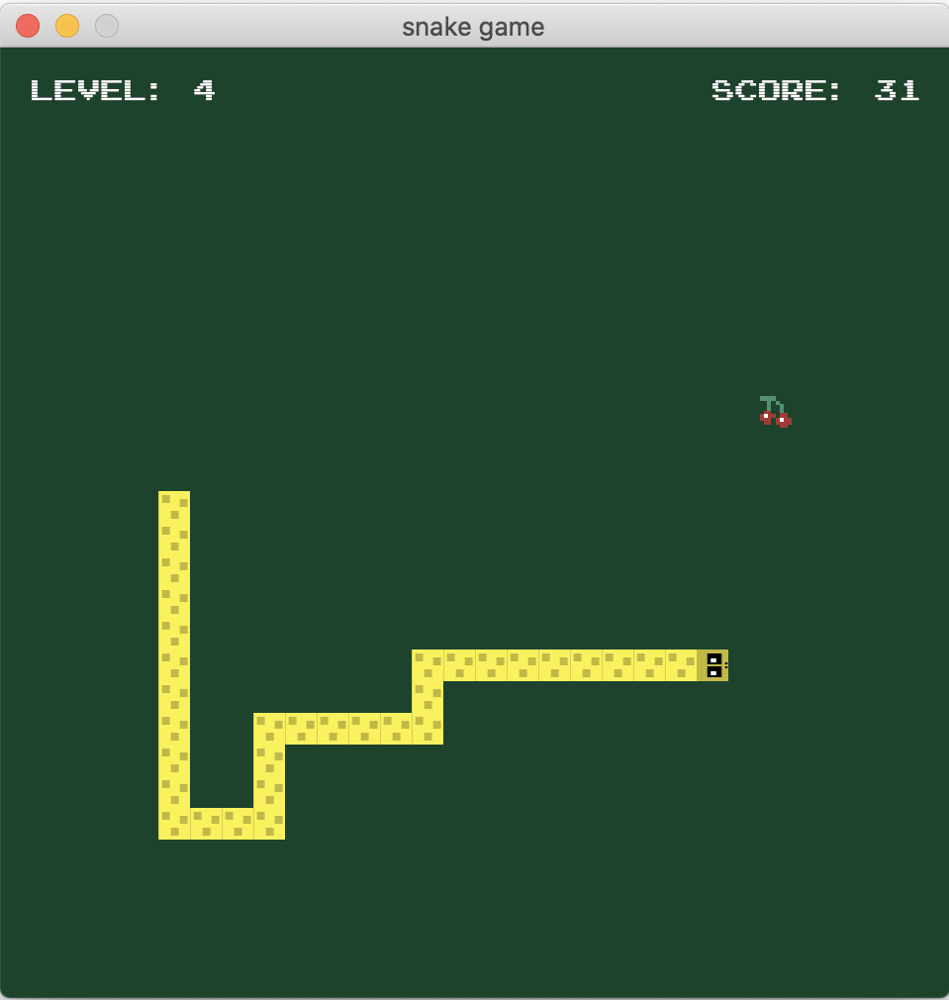

# Snake game

A implementation of the good old snake game in rust programming language using the [ggez](https://ggez.rs/) game library.
The sprite images were created with [aseprite](https://www.aseprite.org/).

## Features: ##

- A user friendly installer for different operating systems.
- A menu screen and a game over screen with indications.
- Different levels based on score.
- The snake can go through bounds of playground and appear on the opposite side of the screen.
- The fruit spawns in random positions in the playground.
- Retro sound whenever the snake eats.

Here's a screenshot of the game:

<p align="center">
  
</p>


[](https://github.com/eiberham/snake/actions?query=branch%3main)

## :video_game: Controls

To play, use arrow keys to move the snake around the screen. It eats anything but you will only get points for eating the fruit. Use `escape` to quit the game.
### How to run it locally :question:

Run the following commands on the terminal:

```shell
foo@bar:~$ git clone https://github.com/eiberham/snake.git
foo@bar:~$ cd snake
foo@bar:~$ cargo run
```

### Create an installer for mac

This is the way I managed to build the app's bundle and create a `.dmg` file, following the [documentation](https://developer.apple.com/library/archive/documentation/CoreFoundation/Conceptual/CFBundles/BundleTypes/BundleTypes.html#//apple_ref/doc/uid/20001119-110730) you can get an idea of how the bundle folder structure is.

Simply run the `build_mac.sh` script within the project's folder, you'll get a `.dmg` file within the bundle_mac folder:

```shell
foo@bar:~$ sh build_mac.sh
```

Now you can share it with any friend, acquaintance or whoever owns a mac.

### What about windows :question:

For windows machines we can use cargo wix crate.
But before doing so we have to run the `build_win.sh` script that is on the root folder.

```shell
foo@bar:~$ sh build_win.sh
```

Next install the wix toolset from [here](https://github.com/wixtoolset/wix3/releases)

Open a command prompt `windows + r` on your machine and run the following commands:

```dos
C:\> cargo install cargo-wix
C:\> cd snake
C:\snake\> cargo wix init
C:\snake\> cargo wix
```

The windows installer (msi) for the game will be in the C:\snake\target\wix folder.

### What about gnu/linux :question:

Simple, by using `cargo-deb`.

This will only work for debian and debian based distros, so in order to create a `.deb` file you ought to install the cargo deb dependency and the specific target to compile to. Check out the targets available by running `rustc --print target-list`. i.e:

```shell
foo@bar:~$ rustup update
foo@bar:~$ cargo install cargo-deb
foo@bar:~$ rustup target add i686-unknown-linux-gnu
foo@bar:~$ cargo deb --target=i686-unknown-linux-gnu
```

Now you should have a `.deb` package ready to be installed in a debian based linux distro. Remember that you can install it by using `dpkg -i package.deb` command.

Upon running the above commands successfully you should have the debian package placed in the `target/i686-unknown-linux-gnu` directory.

### :trollface: Where to download it from ?

- Download for mac :green_apple: [here](https://storage.cloud.google.com/eiberham/Snake.zip?pli=1)

## :pushpin: License

This project is licensed under the MIT License - see the [LICENSE](LICENSE) file for details

